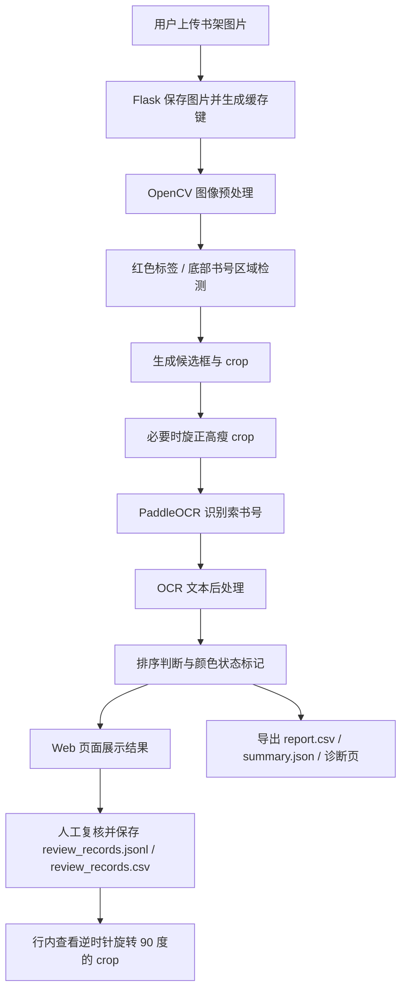
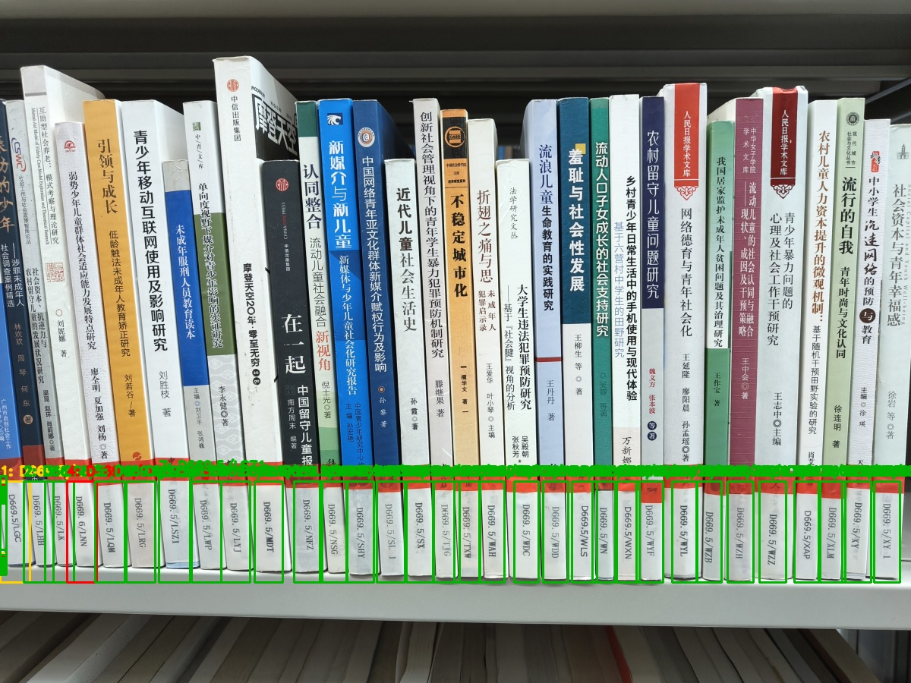

# 图书馆书架智能巡检与索书号识别系统

> Python 课程项目｜Python + Flask + OpenCV + PaddleOCR｜面向书架巡检场景的索书号识别与人工复核辅助工具

本项目面向图书馆书架巡检场景，用户可通过 Web 端或手机端上传书架图片，系统对书脊标签和索书号区域进行检测、裁切和 OCR 识别，并输出识别结果、标注图、裁切图、CSV/JSON 结果文件和诊断页面，支持人工复核记录保存，辅助人工判断书籍排列情况。

需要说明的是，本项目定位为课程项目和巡检辅助工具，不是完整生产级馆藏管理系统。系统目前不连接馆藏数据库，不自动判断缺失书籍，也不把 OCR 结果直接作为最终巡架结论。项目由本人提出整体思路，并在 AI 辅助下完成开发、调试和文档整理；本人能够说明项目需求、运行流程、核心模块作用和主要代码逻辑。

## 目录

- [项目背景](#项目背景)
- [功能特点](#功能特点)
- [技术栈](#技术栈)
- [系统流程](#系统流程)
- [项目结构](#项目结构)
- [核心模块说明](#核心模块说明)
- [运行方式](#运行方式)
- [处理模式](#处理模式)
- [结果导出与人工复核](#结果导出与人工复核)
- [效果展示](#效果展示)
- [测试记录](#测试记录)
- [个人贡献](#个人贡献)
- [已知限制](#已知限制)
- [后续优化方向](#后续优化方向)

## 项目背景

图书馆书架巡检通常需要人工查看书脊标签上的索书号，判断书籍是否按照索书号顺序排列。人工逐本检查效率较低，且容易受到书籍密集、标签较小、拍摄角度、光照条件和书脊遮挡等因素影响。

本项目尝试使用图像处理与 OCR 技术，对书架照片中的索书号进行初步识别，并通过颜色标记、裁切诊断和结果文件辅助人工复核。项目重点不在于替代馆员做最终判断，而是将“肉眼逐本查看”转化为“系统初步识别 + 人工重点复核”的流程。

## 功能特点

| 功能 | 说明 |
| --- | --- |
| Web/手机端访问 | 基于 Flask 提供本机 Web 页面，手机与电脑处于同一局域网时可通过手机浏览器访问。 |
| 多图上传 | 支持上传一张或多张书架图片，并分别生成识别结果。 |
| 书脊标签检测 | 使用 OpenCV 完成图片预处理、颜色空间转换、红色标签检测和候选区域裁切。 |
| OCR 识别 | 调用官方 PaddleOCR 对裁切图中的索书号文本进行识别。 |
| 规则后处理 | 对 `1247.7` / `I247.7`、`O` / `0`、`/` 后首字符误读等常见 OCR 错误进行修正。 |
| 颜色状态提示 | 使用绿色、黄色、红色状态辅助人工判断识别结果和疑似错架情况。 |
| 诊断输出 | 生成标注图、红色 mask、裁切图、OCR crop、诊断 HTML、`report.csv` 和 `summary.json`。 |
| 结果导出与人工复核 | Web 页面提供 CSV/JSON 统一导出入口，可保存每条 OCR 结果的复核状态、修正文本和备注，并支持在复核行内查看逆时针旋转 90 度的 crop。 |
| 缓存复用 | 对重复上传的相同图片复用已有结果，减少重复 OCR 计算。 |
| 姿态提示 | 对拍摄角度明显不可靠的图片给出重拍提示，避免输出大量误识别结果。 |

## 技术栈

| 类别 | 技术 |
| --- | --- |
| 后端服务 | Python、Flask |
| 图像处理 | OpenCV、NumPy |
| OCR 识别 | PaddleOCR、PaddlePaddle |
| 前端展示 | HTML、CSS、JavaScript |
| 结果输出 | CSV、JSON、JSONL、HTML 诊断页 |
| 工程工具 | Git、GitHub、Markdown |

依赖文件 `requirements.txt`：

```txt
numpy
opencv-python
python-bidi==0.4.2
paddleocr
paddlepaddle
flask
```

## 系统流程



完整处理步骤如下：用户在 Web/手机端上传书架图片后，Flask 后端保存上传文件并根据图片内容生成缓存键；核心脚本读取图片、控制尺寸、完成旋转和裁切准备，再通过 OpenCV 进行颜色空间转换和红色标签检测；系统根据检测框生成 crop，必要时对高瘦 crop 旋正后送入 PaddleOCR；OCR 输出结果经过规则后处理后，系统整理识别顺序并输出绿色、黄色、红色状态；最终 Web 端展示识别结果、颜色统计、标注图、诊断页面、导出入口和简单调架建议，同时在结果目录保存 CSV、JSON、裁切图和诊断文件；人工复核时可在每条结果旁选择状态、填写修正文本和备注，并在当前行下方查看逆时针旋转 90 度后的 crop，复核记录保存到本地 JSONL/CSV 文件，便于后续整理错误样例。

## 项目结构

```text
Book_identification/
├── mobile_server.py                 # Flask Web/手机端服务
├── shelf_inspector_fast.py           # 检测、裁切、OCR、排序判断和诊断页生成
├── mobile_web/                       # 前端页面
│   ├── index.html
│   └── style.css
├── data/                             # 本地训练/测试图片说明与样例资源
├── docs/                             # 项目说明、测试记录、已知限制和策略文档
├── stage5_mobile_results/            # 上传、缓存、识别结果、复核记录和最终演示输出
├── requirements.txt                  # Python 依赖
├── WEB版使用说明.md
├── FINAL_VERSION.md
└── README.md
```

## 核心模块说明

### `mobile_server.py`

`mobile_server.py` 是 Flask Web 服务入口，主要负责首页访问、OCR 状态管理、图片上传、核心识别流程调用、结果 JSON 返回、结果文件访问、导出下载、人工复核记录保存和缓存版本管理。主要接口包括：

| 接口 | 作用 |
| --- | --- |
| `GET /` | Web 首页。 |
| `GET /api/status` | 查询 OCR、缓存版本和处理模式状态。 |
| `POST /api/preload` | 预加载 OCR，减少首次识别等待时间。 |
| `POST /api/inspect` | 上传图片并执行识别。 |
| `GET /api/export` | 根据 `result_id` 和 `format=csv/json` 下载 `report.csv` 或 `summary.json`。 |
| `POST /api/review` | 保存人工复核记录，包括状态、修正文本和备注。 |
| `GET /api/reviews` | 按 `result_id` 查询已保存的复核记录。 |
| `GET /results/<path:filename>` | 访问标注图、裁切图、CSV、JSON 和诊断页面等结果文件。 |

当前 Web 缓存版本：`web_official_ocr_stable_20260608_v5`  
当前 OCR 策略：`official_paddleocr_v5_mobile`

### `shelf_inspector_fast.py`

`shelf_inspector_fast.py` 是核心识别脚本，主要负责图像读取和预处理、书脊标签区域检测、候选框筛选、crop 生成和旋正、PaddleOCR 调用、OCR 文本后处理、排序判断、颜色状态标记、诊断页面导出，以及 `report.csv` 和 `summary.json` 输出。

### `mobile_web/`

`mobile_web/` 存放前端页面，主要负责图片选择、模式选择、OCR 状态展示、识别结果展示、CSV/JSON 导出入口、人工复核表单、行内旋转 crop 预览，以及标注图、裁切图、诊断页面和结果文件入口展示。

### `stage5_mobile_results/`

`stage5_mobile_results/` 是运行结果目录，包含上传图片、缓存结果、标注图、红色 mask、裁切图、OCR crop、`report.csv`、`summary.json`、`crop_diagnostics.html`、本地复核记录和最终演示测试输出。人工复核记录默认写入 `stage5_mobile_results/reviews/review_records.jsonl` 和 `stage5_mobile_results/reviews/review_records.csv`。

## 运行方式

### 1. 环境准备

建议使用 Python 3.10 或更高版本。OCR 首次加载可能较慢，CPU 环境可以运行。如果 PaddlePaddle 安装较慢，可根据 PaddleOCR 官方安装说明选择适合自己系统的版本。

### 2. 安装依赖

```bash
pip install -r requirements.txt
```

如下载较慢，可使用国内镜像：

```bash
pip install -r requirements.txt -i https://pypi.tuna.tsinghua.edu.cn/simple
```

### 3. 启动 Web 服务

```bash
python mobile_server.py
```

启动后浏览器访问：

```text
http://127.0.0.1:5000
```

手机访问方式：手机和电脑连接同一个局域网，查看后端启动日志中显示的局域网地址，在手机浏览器打开该地址。如果无法访问，需要检查电脑防火墙是否允许 Python/Flask 入站访问。

## 处理模式

| 模式 | 参数与特点 | 适用场景 |
| --- | --- | --- |
| 普通模式 | `max_side=1200`，不开启 crop retry，速度优先。 | 日常上传、批量初步识别、课程演示。 |
| 精细模式 | `max_side=1600`，开启可疑 crop 重试，速度较慢。 | 黄色结果较多、OCR 失败、crop 可疑或需要更严格复核的图片。 |

## 结果导出与人工复核

完成一次图片识别后，每个结果卡片会提供“导出 CSV”和“导出 JSON”入口。CSV 对应结果目录中的 `report.csv`，适合用 Excel 或表格软件查看；JSON 对应 `summary.json`，适合保存完整结构化结果。

人工复核区域会按 OCR 识别顺序列出每条结果。每条记录可以选择 `confirmed`、`corrected`、`unreadable`、`ignored` 四种状态，填写修正后的索书号和备注，然后点击“保存复核记录”。系统会把记录同时写入：

```text
stage5_mobile_results/reviews/review_records.jsonl
stage5_mobile_results/reviews/review_records.csv
```

为了方便核对 OCR 是否截断或误读，复核行中的“查看crop”不会打开新标签页，而是在当前行下方展开 crop 预览。预览图会逆时针旋转 90 度显示，更接近人工阅读索书号时的方向；再次点击“收起crop”可以隐藏预览。

## 效果展示

项目最终演示输出保存在：

```text
stage5_mobile_results/final_demo_results/
```

如果这些输出文件已提交到仓库，可以在 GitHub README 中直接展示标注图和诊断图。例如：



示例输出文件包括：

```text
stage5_mobile_results/final_demo_results/standard/35a7ea6497538bff_IMG20260523100857/annotated.jpg
stage5_mobile_results/final_demo_results/standard/35a7ea6497538bff_IMG20260523100857/red_mask.jpg
stage5_mobile_results/final_demo_results/standard/35a7ea6497538bff_IMG20260523100857/report.csv
stage5_mobile_results/final_demo_results/standard/35a7ea6497538bff_IMG20260523100857/summary.json
stage5_mobile_results/final_demo_results/standard/35a7ea6497538bff_IMG20260523100857/crop_diagnostics.html
```

## 测试记录

最终演示集测试日期：2026-06-08  
OCR 策略：官方 PaddleOCR mobile OCR  
缓存版本：`web_official_ocr_stable_20260608_v5`

### 普通模式测试

普通模式参数等同 Web 普通模式：`max_side=1200`，不开启 crop retry。

| 图片 | 场景 | 检测 | 绿 | 黄 | 红 | 耗时 |
| --- | --- | ---: | ---: | ---: | ---: | ---: |
| `IMG20260517094334.jpg` | 常规 D669.3 横排书架 | 27 | 24 | 3 | 0 | 22.5s |
| `IMG20260517094422.jpg` | 薄书场景 | 28 | 26 | 2 | 0 | 18.4s |
| `IMG20260517094656.jpg` | 左侧/边缘较难场景 | 32 | 29 | 3 | 0 | 46.9s |
| `IMG20260517094708.jpg` | 倾斜/姿态较差场景 | 23 | 18 | 5 | 0 | 47.3s |
| `IMG20260520094503.jpg` | I247.7 底部横红带场景 | 18 | 18 | 0 | 0 | 15.3s |
| `84f300ba8df684d9_IMG20260523100654.jpg` | 远距离/轻微倾斜场景 | 35 | 34 | 1 | 0 | 23.1s |
| `35a7ea6497538bff_IMG20260523100857.jpg` | 含红色错架示例 | 32 | 30 | 1 | 1 | 25.3s |
| `c973e1dd854ad2be_IMG20260523100852.jpg` | 含红色错架示例 | 29 | 27 | 1 | 1 | 37.9s |

普通模式总耗时约 237.0 秒，平均每张约 29.6 秒。普通模式适合日常使用，黄色结果用于提示人工复核，不强行判红；红色示例用于展示系统能够给出疑似错架提示和调架建议。

### 精细模式抽测

精细模式参数等同 Web 精细模式：`max_side=1600`，开启 crop retry。

| 图片 | 场景 | 检测 | 绿 | 黄 | 红 | 耗时 | 说明 |
| --- | --- | ---: | ---: | ---: | ---: | ---: | --- |
| `IMG20260517094422.jpg` | 薄书场景 | 28 | 28 | 0 | 0 | 58.5s | 精细模式可消除普通模式中的少量黄色复核项。 |
| `IMG20260517094708.jpg` | 姿态较差场景 | 0 | 0 | 0 | 0 | 0.4s | 系统直接提示重拍，不继续消耗 OCR 时间。 |
| `35a7ea6497538bff_IMG20260523100857.jpg` | 含红色错架示例 | 31 | 29 | 1 | 1 | 208.1s | 精细模式保留红色错架判断，同时对 crop 进行更严格复核。 |
| `c973e1dd854ad2be_IMG20260523100852.jpg` | 含红色错架示例 | 29 | 25 | 3 | 1 | 170.7s | 精细模式用于问题样本复核，速度明显慢于普通模式。 |

## 个人贡献

- 提出图书馆书架巡检与索书号识别的项目思路，明确“上传图片、检测标签、裁切候选区域、OCR 识别、人工复核”的整体流程。
- 在 AI 辅助下完成项目开发、运行调试和多轮迭代，能够说明核心模块作用、接口流程和主要代码逻辑。
- 参与整理 Flask Web 服务和手机端访问流程，实现图片上传、结果返回、缓存复用和诊断页面查看等功能。
- 理解并调整 OpenCV 图像处理规则，包括颜色空间转换、红色区域检测、候选框筛选和 crop 生成。
- 使用官方 PaddleOCR 完成文字识别调用，并整理 OCR 结果后处理策略。
- 整理 README、使用说明、最终项目说明、测试记录和已知限制，使项目更适合课程展示、GitHub 展示和简历说明。

## 已知限制

本系统是书架巡检辅助工具，不是完全自动化馆藏管理系统。当前系统不连接馆藏数据库，不做馆藏比对，不自动判断缺失书籍，不把黄色补框直接作为红色错架依据，也不默认使用自训练 OCR 模型。

以下情况仍需要人工复核：图片明显倾斜、远距离拍摄或透视严重；索书号被红色标签、污渍、反光、阴影或手遮挡；书号模糊、过小、过亮或过暗；边缘半本书入镜导致 crop 不完整；很薄的书、多个书号距离过近或存在非标准索书号；OCR 置信度低、格式不完整或系统标黄的结果。

## 后续优化方向

- 增加历史记录页面，方便查看多次上传和识别结果。
- 基于人工复核记录统计高频错误类型，进一步优化 crop 规则和 OCR 后处理规则。
- 补充更多不同书架、不同光照和不同标签样式的测试样例。
- 如继续提升速度，可考虑更快硬件、GPU 推理或替换 OCR 推理框架。
