# 图书馆书架智能巡检原型演示报告

| 图片 | 方向 | 质量 | 检测书本数 | 错序/可疑数 | 耗时 | 结果图 |
| --- | --- | --- | ---: | ---: | ---: | --- |
| badpos.jpg | bad_position | bad | 0 | 0 | 0.8s | badpos/annotated.jpg |
| IMG20260516094220.jpg | none | good | 27 | 0 | 81.9s | IMG20260516094220/annotated.jpg |
| IMG20260517094040.jpg | none | good | 28 | 0 | 66.9s | IMG20260517094040/annotated.jpg |
| IMG20260517094107.jpg | none | good | 35 | 0 | 69.6s | IMG20260517094107/annotated.jpg |
| IMG20260517094139.jpg | none | good | 30 | 0 | 41.9s | IMG20260517094139/annotated.jpg |
| IMG20260517094231.jpg | none | good | 32 | 0 | 42.1s | IMG20260517094231/annotated.jpg |
| IMG20260517094303.jpg | none | good | 30 | 0 | 27.9s | IMG20260517094303/annotated.jpg |
| IMG20260517094312.jpg | none | good | 29 | 0 | 17.2s | IMG20260517094312/annotated.jpg |
| IMG20260517094323.jpg | none | good | 11 | 1 | 49.0s | IMG20260517094323/annotated.jpg |
| IMG20260517094334.jpg | none | good | 16 | 0 | 39.8s | IMG20260517094334/annotated.jpg |
| IMG20260517094402.jpg | none | good | 27 | 0 | 28.8s | IMG20260517094402/annotated.jpg |
| IMG20260517094422.jpg | none | good | 27 | 0 | 30.8s | IMG20260517094422/annotated.jpg |
| IMG20260517094431.jpg | none | good | 30 | 1 | 30.2s | IMG20260517094431/annotated.jpg |
| IMG20260517094437.jpg | none | good | 29 | 0 | 29.0s | IMG20260517094437/annotated.jpg |
| IMG20260517094656.jpg | none | good | 20 | 0 | 45.9s | IMG20260517094656/annotated.jpg |
| IMG20260517094708.jpg | none | good | 18 | 0 | 28.2s | IMG20260517094708/annotated.jpg |

- 本批图片总耗时：630.2s

## 识别详情

### badpos.jpg

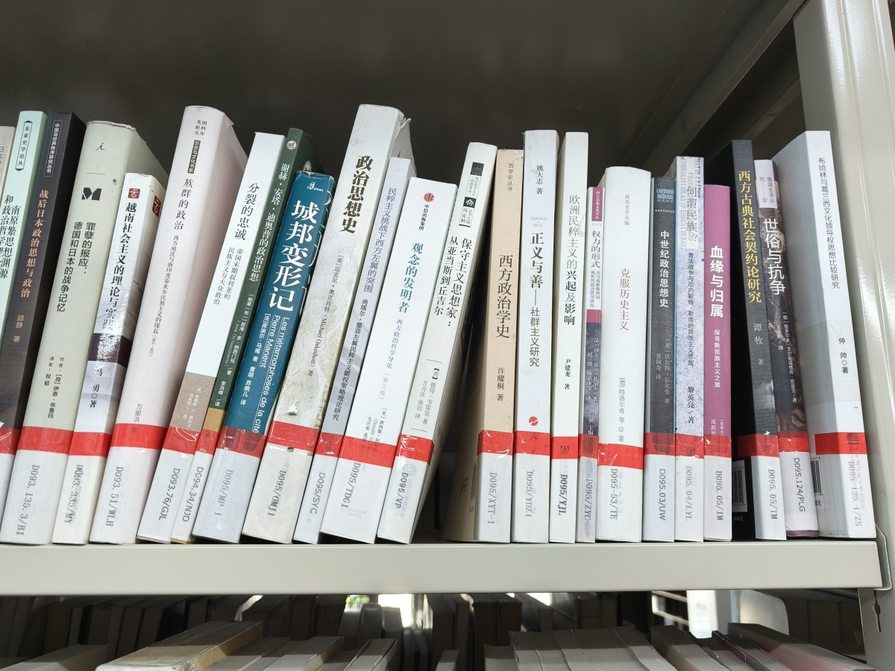

- 自动选择方向：bad_position
- 图像质量：bad，评分：0.0
- 检测书本数：0
- 本图耗时：0.8s
- 错序/可疑位置：无
- 系统提示：未检测到红色标签或索书号。
- 当前顺序：无
- 推荐顺序：无

### IMG20260516094220.jpg

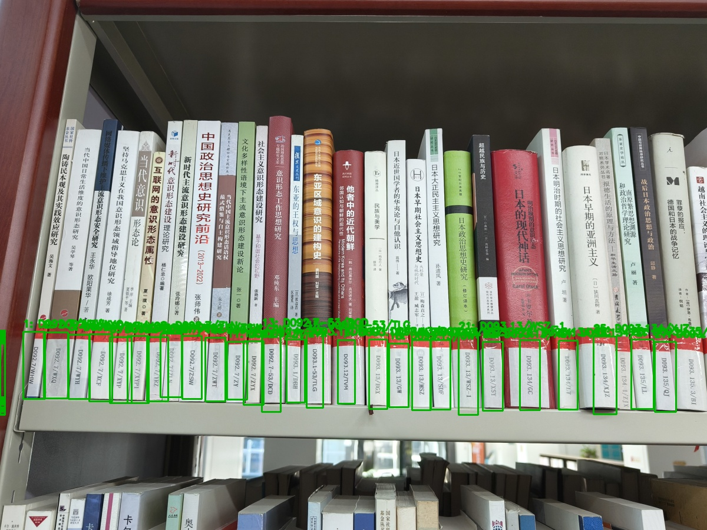

- 自动选择方向：none
- 图像质量：good，评分：98.6
- 检测书本数：27
- 本图耗时：81.9s
- 错序/可疑位置：无
- 系统提示：图像质量较好。
- 当前顺序：D092.7/WHW -> D092.7/WXQ -> D092.7/WYH -> D092.7/XCF -> D092.7/XYP -> D092.7/XYP1 -> D092.7/YRZ -> D092.7/ZLN -> D092.7/ZSW -> D092.7/ZWT -> D092.7/ZY -> D092.7/ZYX -> D092.7-53/DCD -> D093.1/DBH -> D093.1-53/TLG -> D093.12/TVM -> D093.13/BGX -> D093.13/GW -> D093.13/MSZ -> D093.13/SDF -> D093.13/WSZ-1 -> D093.13/XSY -> D093.134/GC -> D093.134/LT -> D093.134/XJZ -> D093.135/LL -> D093.135/QJ
- 推荐顺序：D092.7/WHW -> D092.7/WXQ -> D092.7/WYH -> D092.7/XCF -> D092.7/XYP -> D092.7/XYP1 -> D092.7/YRZ -> D092.7/ZLN -> D092.7/ZSW -> D092.7/ZWT -> D092.7/ZY -> D092.7/ZYX -> D092.7-53/DCD -> D093.1/DBH -> D093.1-53/TLG -> D093.12/TVM -> D093.13/BGX -> D093.13/GW -> D093.13/MSZ -> D093.13/SDF -> D093.13/WSZ-1 -> D093.13/XSY -> D093.134/GC -> D093.134/LT -> D093.134/XJZ -> D093.135/LL -> D093.135/QJ

### IMG20260517094040.jpg

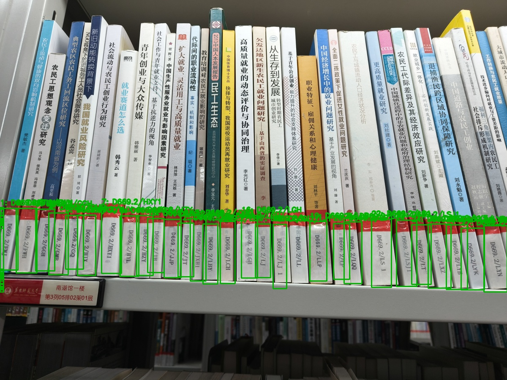

- 自动选择方向：none
- 图像质量：good，评分：98.8
- 检测书本数：28
- 本图耗时：66.9s
- 错序/可疑位置：无
- 系统提示：图像质量较好。
- 当前顺序：D669.2/FMJ -> D669.2/FWH -> D669.2/GGH -> D669.2/GMB -> D669.2/GQ -> D669.2/HJX -> D669.2/HXY1 -> D669.2/HYL -> D669.2/HZY -> D669.2/JH -> D669.2/JJP -> D669.2/JT -> D669.2/JXH1 -> D669.2/LBY -> D669.2/LCH -> D669.2/LGH -> D669.2/LJ -> D669.2/LJ1 -> D669.2/LLP -> D669.2/LP -> D669.2/LQQ -> D669.2/LS1 -> D669.2/LSJ1 -> D669.2/LT -> D669.2/LXZ -> D669.2/LYB -> D669.2/LYK -> D669.2/LYN
- 推荐顺序：D669.2/FMJ -> D669.2/FWH -> D669.2/GGH -> D669.2/GMB -> D669.2/GQ -> D669.2/HJX -> D669.2/HXY1 -> D669.2/HYL -> D669.2/HZY -> D669.2/JH -> D669.2/JJP -> D669.2/JT -> D669.2/JXH1 -> D669.2/LBY -> D669.2/LCH -> D669.2/LGH -> D669.2/LJ -> D669.2/LJ1 -> D669.2/LLP -> D669.2/LP -> D669.2/LQQ -> D669.2/LS1 -> D669.2/LSJ1 -> D669.2/LT -> D669.2/LXZ -> D669.2/LYB -> D669.2/LYK -> D669.2/LYN

### IMG20260517094107.jpg

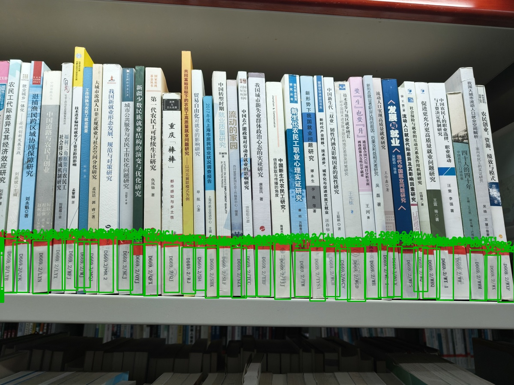

- 自动选择方向：none
- 图像质量：good，评分：97.4
- 检测书本数：35
- 本图耗时：69.6s
- 错序/可疑位置：无
- 系统提示：图像质量较好。
- 当前顺序：D669.2/LYB -> D669.2/LYK -> D669.2/LYN -> D669.2/LYX -> D669.2/MFJ -> D669.2/MJ -> D669.2/MQJ -> D669.2/MR2 -> D669.3/NCJ -> D669.2/OYJ -> D669.2/QFX -> D669.2/QJ -> D669.2/RJ -> D669.2/SH -> D669.2/SHK -> D669.2/SLF -> D669.2/SZX -> D669.2/TCC -> D669.2/THF -> D669.2/TJJ -> D669.2/TM -> D669.2/TYS1 -> D669.2/WCH -> D669.2/WCY -> D669.2/D -> D669.2/WH -> D669.2/WL1 -> D669.2/WLX -> D669.2/WPS -> D669.2/WQ -> D669.2/WRQ -> D669.2/WT1 -> D669.2/WWM -> D669.2/WX -> D669.2/WXF
- 推荐顺序：D669.2/LYB -> D669.2/LYK -> D669.2/LYN -> D669.2/LYX -> D669.2/MFJ -> D669.2/MJ -> D669.2/MQJ -> D669.2/MR2 -> D669.3/NCJ -> D669.2/OYJ -> D669.2/QFX -> D669.2/QJ -> D669.2/RJ -> D669.2/SH -> D669.2/SHK -> D669.2/SLF -> D669.2/SZX -> D669.2/TCC -> D669.2/THF -> D669.2/TJJ -> D669.2/TM -> D669.2/TYS1 -> D669.2/WCH -> D669.2/WCY -> D669.2/D -> D669.2/WH -> D669.2/WL1 -> D669.2/WLX -> D669.2/WPS -> D669.2/WQ -> D669.2/WRQ -> D669.2/WT1 -> D669.2/WWM -> D669.2/WX -> D669.2/WXF

### IMG20260517094139.jpg

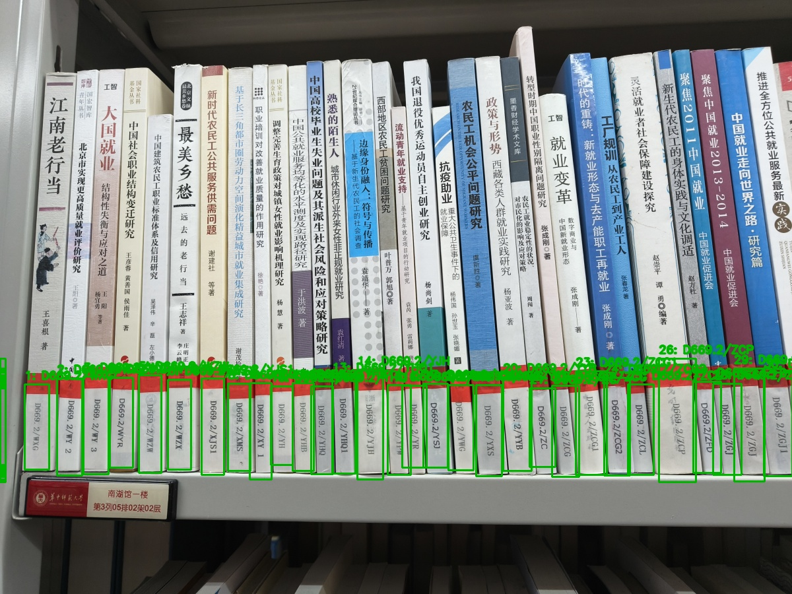

- 自动选择方向：none
- 图像质量：good，评分：97.5
- 检测书本数：30
- 本图耗时：41.9s
- 错序/可疑位置：无
- 系统提示：图像质量较好。
- 当前顺序：D669.2/WXG -> D669.2/WY2 -> D669.2/WY3 -> D669.2/WYR -> D669.2/WZW -> D669.2/WZX -> D669.2/XJS1 -> D669.2/XMS -> D669.2/XY1 -> D669.2/YH -> D669.2/YHB -> D669.2/YHQ -> D669.2/YHQ1 -> D669.2/YJH -> D669.2/YPW -> D669.2/YR -> D669.2/YSJ -> D669.2/YWG -> D669.2/YXS -> D669.2/YYB -> D669.2/ZC -> D669.2/ZCG -> D669.2/ZCG1 -> D669.2/ZCG2 -> D669.2/ZCL -> D669.2/ZCP -> D669.2/ZFD -> D669.2/ZGJ -> D669.2/ZGJ -> D669.2/ZGJ1
- 推荐顺序：D669.2/WXG -> D669.2/WY2 -> D669.2/WY3 -> D669.2/WYR -> D669.2/WZW -> D669.2/WZX -> D669.2/XJS1 -> D669.2/XMS -> D669.2/XY1 -> D669.2/YH -> D669.2/YHB -> D669.2/YHQ -> D669.2/YHQ1 -> D669.2/YJH -> D669.2/YPW -> D669.2/YR -> D669.2/YSJ -> D669.2/YWG -> D669.2/YXS -> D669.2/YYB -> D669.2/ZC -> D669.2/ZCG -> D669.2/ZCG1 -> D669.2/ZCG2 -> D669.2/ZCL -> D669.2/ZCP -> D669.2/ZFD -> D669.2/ZGJ -> D669.2/ZGJ -> D669.2/ZGJ1

### IMG20260517094231.jpg

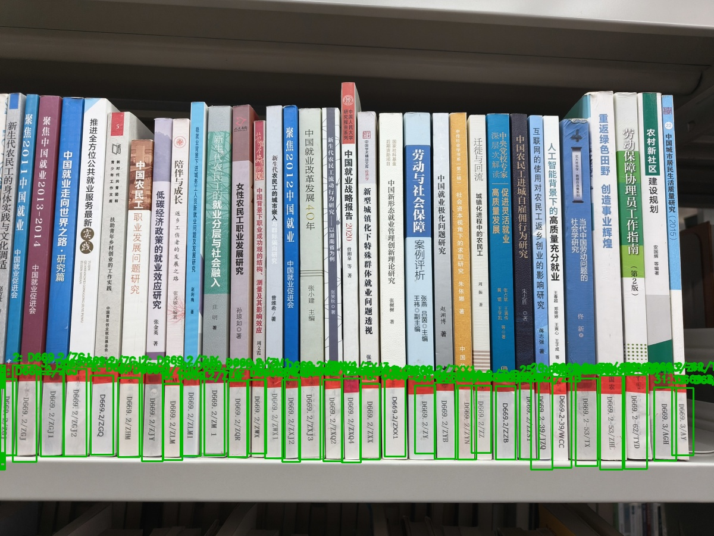

- 自动选择方向：none
- 图像质量：good，评分：97.7
- 检测书本数：32
- 本图耗时：42.1s
- 错序/可疑位置：无
- 系统提示：图像质量较好。
- 当前顺序：D669.2/ZGJ -> D669.2/ZGJ -> D669.2/ZGJ1 -> D669.2/7GJ2 -> D669.2/ZGQ -> D669.2/ZHM -> D669.2/7JY -> D669.2/ZLM -> D669.2/ZLM1 -> D669.2/ZM1 -> D669.2/ZQR -> D669.2/ZWX -> D669.2/ZWX1 -> D669.2/ZXJ2 -> D669.2/ZXJ3 -> D669.2/7XQ2 -> D669.2/ZXQ4 -> D669.2/ZXX -> D669.2/ZXX1 -> D669.2/ZY -> D669.2/ZYB -> D669.2/ZYN -> D669.2/ZZ -> D669.2/ZZB -> D669.2/ZZS1 -> D669.2-39/JZQ -> D669.2-39/WCC -> D669.2-53/TX -> D669.2-53/ZHL -> D669.2-62/TYD -> D669.3/AGH -> D669.3/AY
- 推荐顺序：D669.2/ZGJ -> D669.2/ZGJ -> D669.2/ZGJ1 -> D669.2/7GJ2 -> D669.2/ZGQ -> D669.2/ZHM -> D669.2/7JY -> D669.2/ZLM -> D669.2/ZLM1 -> D669.2/ZM1 -> D669.2/ZQR -> D669.2/ZWX -> D669.2/ZWX1 -> D669.2/ZXJ2 -> D669.2/ZXJ3 -> D669.2/7XQ2 -> D669.2/ZXQ4 -> D669.2/ZXX -> D669.2/ZXX1 -> D669.2/ZY -> D669.2/ZYB -> D669.2/ZYN -> D669.2/ZZ -> D669.2/ZZB -> D669.2/ZZS1 -> D669.2-39/JZQ -> D669.2-39/WCC -> D669.2-53/TX -> D669.2-53/ZHL -> D669.2-62/TYD -> D669.3/AGH -> D669.3/AY

### IMG20260517094303.jpg

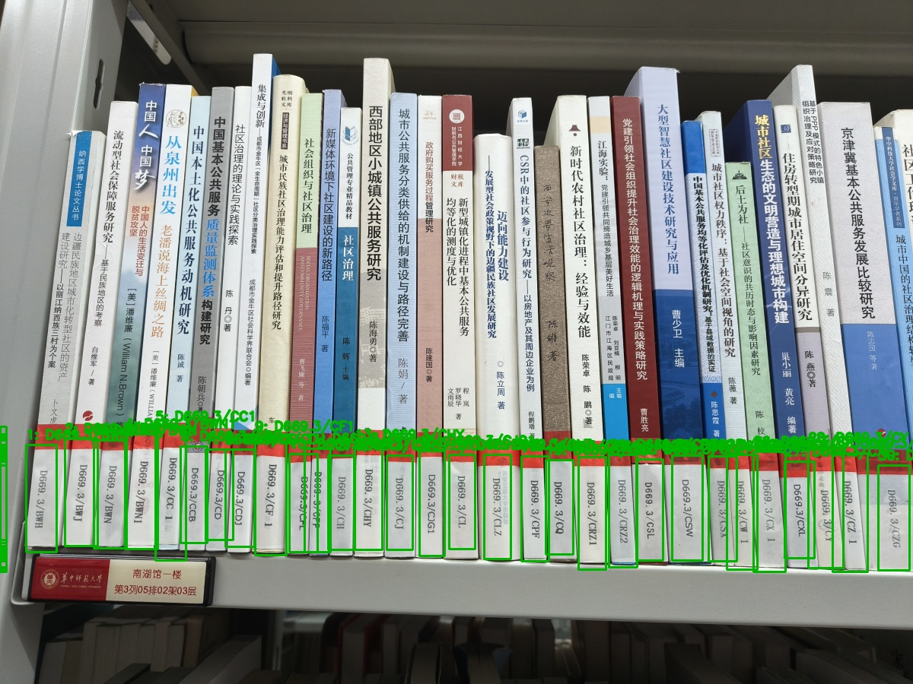

- 自动选择方向：none
- 图像质量：good，评分：99.2
- 检测书本数：30
- 本图耗时：27.9s
- 错序/可疑位置：无
- 系统提示：图像质量较好。
- 当前顺序：D669.3/BWH -> D669.3/BWJ -> D669.3/BWN -> D669.3/BWN1 -> D669.3/CC1 -> D669.3/CCB -> D669.3/CD -> D669.3/CDJ -> D669.3/CF1 -> D669.3/CFL -> D669.3/CFP -> D669.3/CH -> D669.3/CHY -> D669.3/CJ -> D669.3/CJG1 -> D669.3/CL -> D669.3/CLZ -> D669.3/CPF -> D669.3/CQ -> D669.3/CRZ1 -> D669.3/CRZ2 -> D669.3/CSL -> D669.3/CSW -> D669.3/CSX -> D669.3/CW1 -> D669.3/CX1 -> D669.3/CXL -> D669.3/CY -> D669.3/CZ1 -> D669.3/CZG
- 推荐顺序：D669.3/BWH -> D669.3/BWJ -> D669.3/BWN -> D669.3/BWN1 -> D669.3/CC1 -> D669.3/CCB -> D669.3/CD -> D669.3/CDJ -> D669.3/CF1 -> D669.3/CFL -> D669.3/CFP -> D669.3/CH -> D669.3/CHY -> D669.3/CJ -> D669.3/CJG1 -> D669.3/CL -> D669.3/CLZ -> D669.3/CPF -> D669.3/CQ -> D669.3/CRZ1 -> D669.3/CRZ2 -> D669.3/CSL -> D669.3/CSW -> D669.3/CSX -> D669.3/CW1 -> D669.3/CX1 -> D669.3/CXL -> D669.3/CY -> D669.3/CZ1 -> D669.3/CZG

### IMG20260517094312.jpg

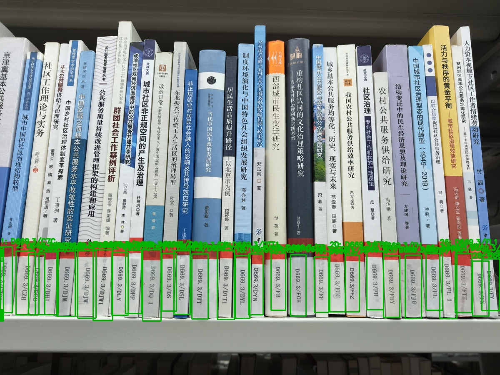

- 自动选择方向：none
- 图像质量：good，评分：99.1
- 检测书本数：29
- 本图耗时：17.2s
- 错序/可疑位置：无
- 系统提示：图像质量较好。
- 当前顺序：D669.3/C7C -> D669.3/CZH -> D669.3/DBB -> D669.3/DHJ -> D669.3/DJM -> D669.3/DJW -> D669.3/DJW1 -> D669.3/DLY -> D669.3/DPP -> D669.3/DQ1 -> D669.3/DS -> D669.3/DSL -> D669.3/DTT -> D669.3/DTT1 -> D669.3/DYL -> D669.3/DYN -> D669.3/FB -> D669.3/FCH -> D669.3/FF -> D669.3/FFC -> D669.3/FFZ -> D669.3/FH -> D669.3/FHY -> D669.3/FJG -> D669.3/FL -> D669.3/FL1 -> D669.3/FTT -> D669.3/FX -> D669.3/FY
- 推荐顺序：D669.3/C7C -> D669.3/CZH -> D669.3/DBB -> D669.3/DHJ -> D669.3/DJM -> D669.3/DJW -> D669.3/DJW1 -> D669.3/DLY -> D669.3/DPP -> D669.3/DQ1 -> D669.3/DS -> D669.3/DSL -> D669.3/DTT -> D669.3/DTT1 -> D669.3/DYL -> D669.3/DYN -> D669.3/FB -> D669.3/FCH -> D669.3/FF -> D669.3/FFC -> D669.3/FFZ -> D669.3/FH -> D669.3/FHY -> D669.3/FJG -> D669.3/FL -> D669.3/FL1 -> D669.3/FTT -> D669.3/FX -> D669.3/FY

### IMG20260517094323.jpg

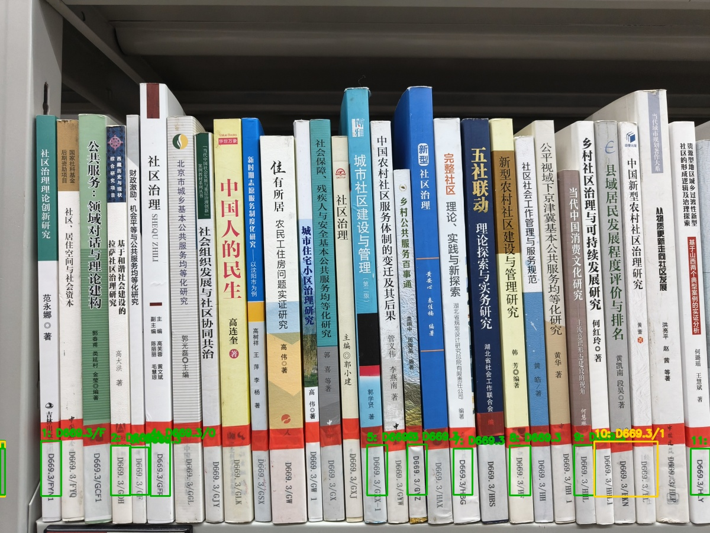

- 自动选择方向：none
- 图像质量：good，评分：86.4
- 检测书本数：11
- 本图耗时：49.0s
- 错序/可疑位置：10
- 系统提示：图像质量较好。
- 当前顺序：D669.3/F -> D669.3 -> D669.3 -> D669.3/0 -> D669.3 -> D669.3 -> D669.3 -> D669.3 -> D669.3 -> D669.3/1 -> D669.3
- 推荐顺序：D669.3/F -> D669.3 -> D669.3 -> D669.3/0 -> D669.3 -> D669.3 -> D669.3 -> D669.3 -> D669.3 -> D669.3/1 -> D669.3

| 位置 | 识别结果 | 状态 | 原因 | 推荐位置 |
| ---: | --- | --- | --- | ---: |
| 10 | D669.3/1 | yellow | OCR 置信度较低 |  |

### IMG20260517094334.jpg

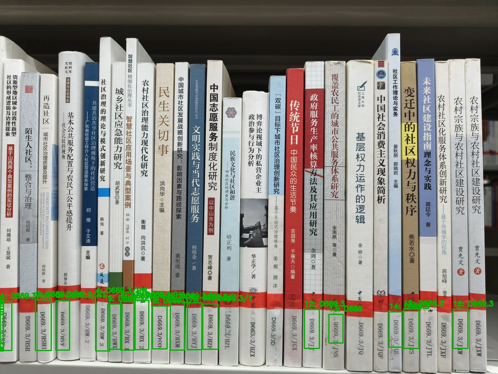

- 自动选择方向：none
- 图像质量：good，评分：92.4
- 检测书本数：16
- 本图耗时：39.8s
- 错序/可疑位置：无
- 系统提示：图像质量较好。
- 当前顺序：D669.3/H1 -> D669.3/H1 -> D669.3/H1 -> D669.3/HW -> D669.3/1 -> D669.3/H1 -> D669.3/H1 -> D669.3/H -> D669.3/H -> D669.3/1 -> D669.3/1 -> D669.3 -> D669 -> D669.3 -> D669.3 -> D669.3
- 推荐顺序：D669.3/H1 -> D669.3/H1 -> D669.3/H1 -> D669.3/HW -> D669.3/1 -> D669.3/H1 -> D669.3/H1 -> D669.3/H -> D669.3/H -> D669.3/1 -> D669.3/1 -> D669.3 -> D669 -> D669.3 -> D669.3 -> D669.3

### IMG20260517094402.jpg

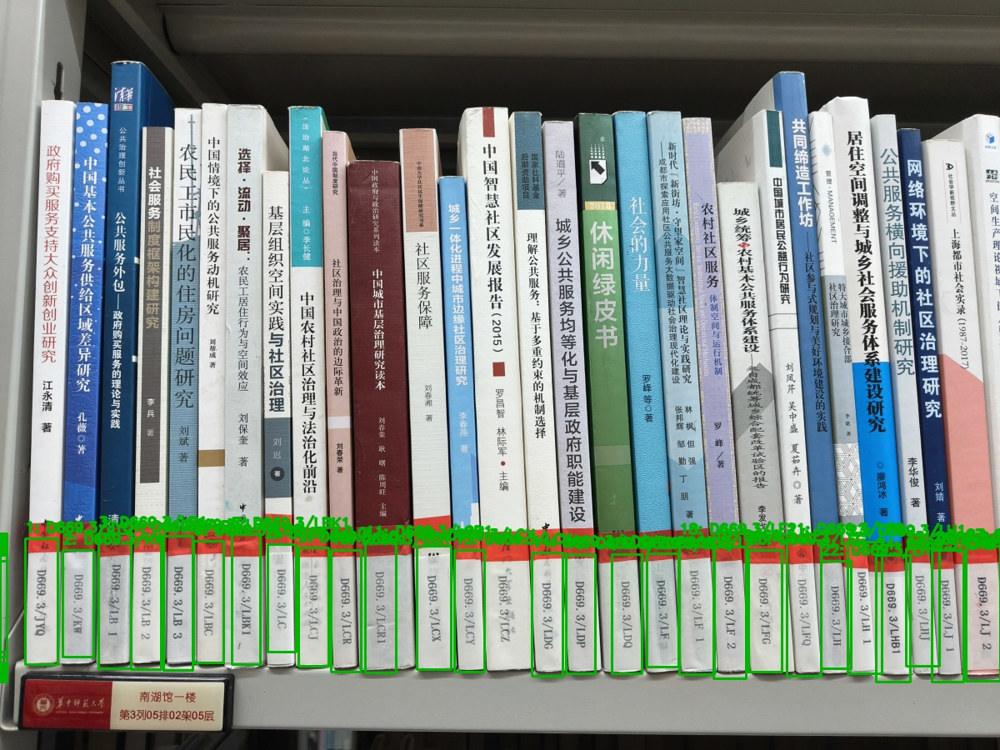

- 自动选择方向：none
- 图像质量：good，评分：99.0
- 检测书本数：27
- 本图耗时：28.8s
- 错序/可疑位置：无
- 系统提示：图像质量较好。
- 当前顺序：D669.3/JYQ -> D669.3/KW -> D669.3/LB1 -> D669.3/LB2 -> D669.3/LB3 -> D669.3/LBC -> D669.3/LBK1 -> D669.3/LC -> D669.3/LCJ -> D669.3/LCR -> D669.3/LCR1 -> D669.3/LCX -> D669.3/LCY -> D669.3/LDG -> D669.3/LDP -> D669.3/LDQ -> D669.3/LF -> D669.3/LF1 -> D669.3/LF2 -> D669.3/LFG -> D669.3/LFQ -> D669.3/LH -> D669.3/LH1 -> D669.3/LHB1 -> D669.3/LHJ -> D669.3/LJ1 -> D669.3/LJ2
- 推荐顺序：D669.3/JYQ -> D669.3/KW -> D669.3/LB1 -> D669.3/LB2 -> D669.3/LB3 -> D669.3/LBC -> D669.3/LBK1 -> D669.3/LC -> D669.3/LCJ -> D669.3/LCR -> D669.3/LCR1 -> D669.3/LCX -> D669.3/LCY -> D669.3/LDG -> D669.3/LDP -> D669.3/LDQ -> D669.3/LF -> D669.3/LF1 -> D669.3/LF2 -> D669.3/LFG -> D669.3/LFQ -> D669.3/LH -> D669.3/LH1 -> D669.3/LHB1 -> D669.3/LHJ -> D669.3/LJ1 -> D669.3/LJ2

### IMG20260517094422.jpg

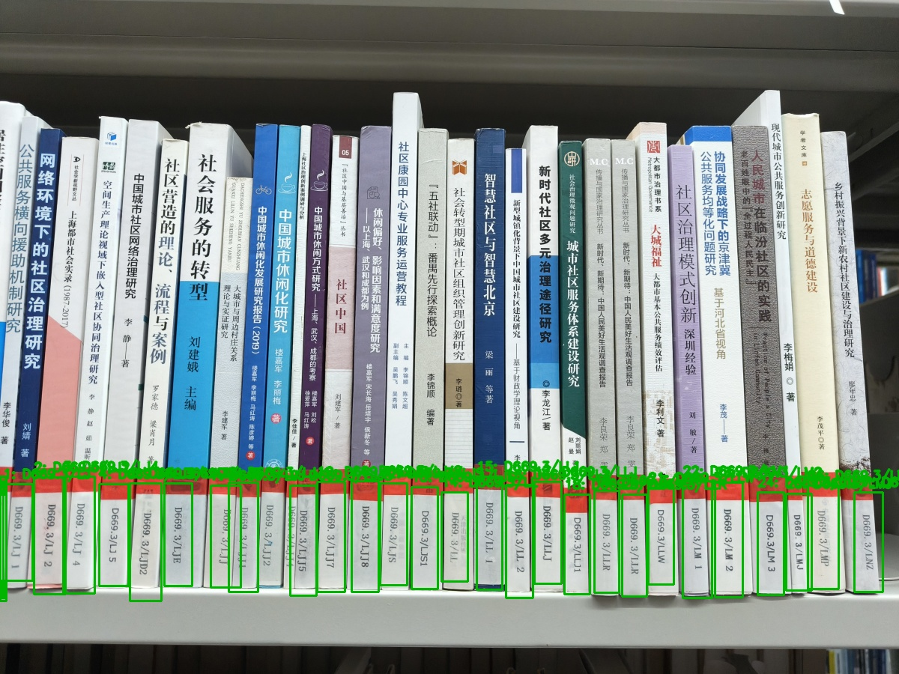

- 自动选择方向：none
- 图像质量：good，评分：98.9
- 检测书本数：27
- 本图耗时：30.8s
- 错序/可疑位置：无
- 系统提示：图像质量较好。
- 当前顺序：D669.3/LJ -> D669.3/LJ2 -> D669.3/LJ4 -> D669.3/LJ5 -> D669.3/LJD2 -> D669.3/LJE -> D669.3/LJJ -> D669.3/LJJ1 -> D669.3/LJJ5 -> D669.3/LJJ7 -> D669.3/LJJ8 -> D669.3/LJS -> D669.3/LJS1 -> D669.3/LL -> D669.3/LL1 -> D669.3/LL2 -> D669.3/LLJ -> D669.3/LLJ1 -> D669.3/LLR -> D669.3/LLR -> D669.3/LLW -> D669.3/LM1 -> D669.3/LM2 -> D669.3/LM3 -> D669.3/LMJ -> D669.3/LMP -> D669.3/LNZ
- 推荐顺序：D669.3/LJ -> D669.3/LJ2 -> D669.3/LJ4 -> D669.3/LJ5 -> D669.3/LJD2 -> D669.3/LJE -> D669.3/LJJ -> D669.3/LJJ1 -> D669.3/LJJ5 -> D669.3/LJJ7 -> D669.3/LJJ8 -> D669.3/LJS -> D669.3/LJS1 -> D669.3/LL -> D669.3/LL1 -> D669.3/LL2 -> D669.3/LLJ -> D669.3/LLJ1 -> D669.3/LLR -> D669.3/LLR -> D669.3/LLW -> D669.3/LM1 -> D669.3/LM2 -> D669.3/LM3 -> D669.3/LMJ -> D669.3/LMP -> D669.3/LNZ

### IMG20260517094431.jpg

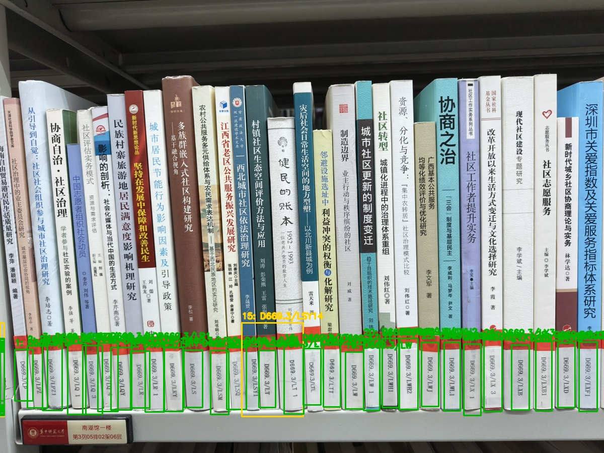

- 自动选择方向：none
- 图像质量：good，评分：94.2
- 检测书本数：30
- 本图耗时：30.2s
- 错序/可疑位置：15
- 系统提示：图像质量较好。
- 当前顺序：D669.3/LP -> D669.3/LPZ -> D669.3/LPZ1 -> D669.3/LQ1 -> D669.3/LQ3 -> D669.3/LQ4 -> D669.3/LQY -> D669.3/LR -> D669.3/LR1 -> D669.3/LRY -> D669.3/LS -> D669.3/LSM -> D669.3/LSQ -> D669.3/LT -> D669.3/LSY14 -> D669.3/LT1 -> D669.3/LTL -> D669.3/LTT -> D669.3/LW -> D669.3/LW1 -> D669.3/LWH1 -> D669.3/LWH2 -> D669.3/LWJ -> D669.3/LWL1 -> D669.3/LX1 -> D669.3/LX3 -> D669.3/LXB -> D669.3/LXB1 -> D669.3/LXD -> D669.3/LXF1
- 推荐顺序：D669.3/LP -> D669.3/LPZ -> D669.3/LPZ1 -> D669.3/LQ1 -> D669.3/LQ3 -> D669.3/LQ4 -> D669.3/LQY -> D669.3/LR -> D669.3/LR1 -> D669.3/LRY -> D669.3/LS -> D669.3/LSM -> D669.3/LSQ -> D669.3/LT -> D669.3/LSY14 -> D669.3/LT1 -> D669.3/LTL -> D669.3/LTT -> D669.3/LW -> D669.3/LW1 -> D669.3/LWH1 -> D669.3/LWH2 -> D669.3/LWJ -> D669.3/LWL1 -> D669.3/LX1 -> D669.3/LX3 -> D669.3/LXB -> D669.3/LXB1 -> D669.3/LXD -> D669.3/LXF1

| 位置 | 识别结果 | 状态 | 原因 | 推荐位置 |
| ---: | --- | --- | --- | ---: |
| 15 | D669.3/LSY14 | yellow | OCR 置信度较低 |  |

### IMG20260517094437.jpg

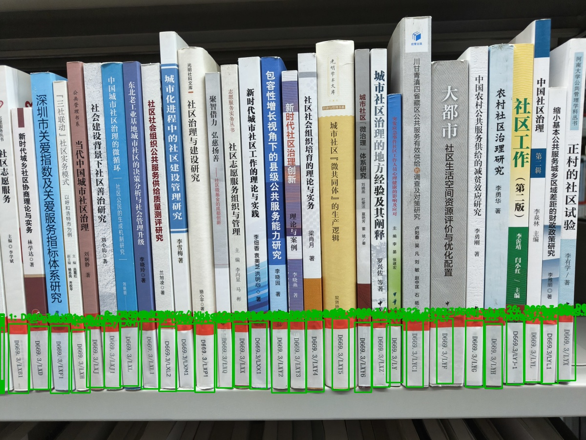

- 自动选择方向：none
- 图像质量：good，评分：99.4
- 检测书本数：29
- 本图耗时：29.0s
- 错序/可疑位置：无
- 系统提示：图像质量较好。
- 当前顺序：D669.3/LXB1 -> D669.3/LXD -> D669.3/LXF1 -> D669.3/LXH -> D669.3/LXJ -> D669.3/LXJ1 -> D669.3/LXL -> D669.3/LXL1 -> D669.3/LXL2 -> D669.3/LXM1 -> D669.3/LXP1 -> D669.3/LXQ -> D669.3/LXX -> D669.3/LXX1 -> D669.3/LXY2 -> D669.3/LXY3 -> D669.3/LXY4 -> D669.3/LXY5 -> D669.3/LXY6 -> D669.3/LXZ -> D669.3/LY -> D669.3/LYC1 -> D669.3/LYF -> D669.3/LYG -> D669.3/LYH -> D669.3/LYJ-1 -> D669.3/LYL -> D669.3/LYL1 -> D669.3/LYX
- 推荐顺序：D669.3/LXB1 -> D669.3/LXD -> D669.3/LXF1 -> D669.3/LXH -> D669.3/LXJ -> D669.3/LXJ1 -> D669.3/LXL -> D669.3/LXL1 -> D669.3/LXL2 -> D669.3/LXM1 -> D669.3/LXP1 -> D669.3/LXQ -> D669.3/LXX -> D669.3/LXX1 -> D669.3/LXY2 -> D669.3/LXY3 -> D669.3/LXY4 -> D669.3/LXY5 -> D669.3/LXY6 -> D669.3/LXZ -> D669.3/LY -> D669.3/LYC1 -> D669.3/LYF -> D669.3/LYG -> D669.3/LYH -> D669.3/LYJ-1 -> D669.3/LYL -> D669.3/LYL1 -> D669.3/LYX

### IMG20260517094656.jpg

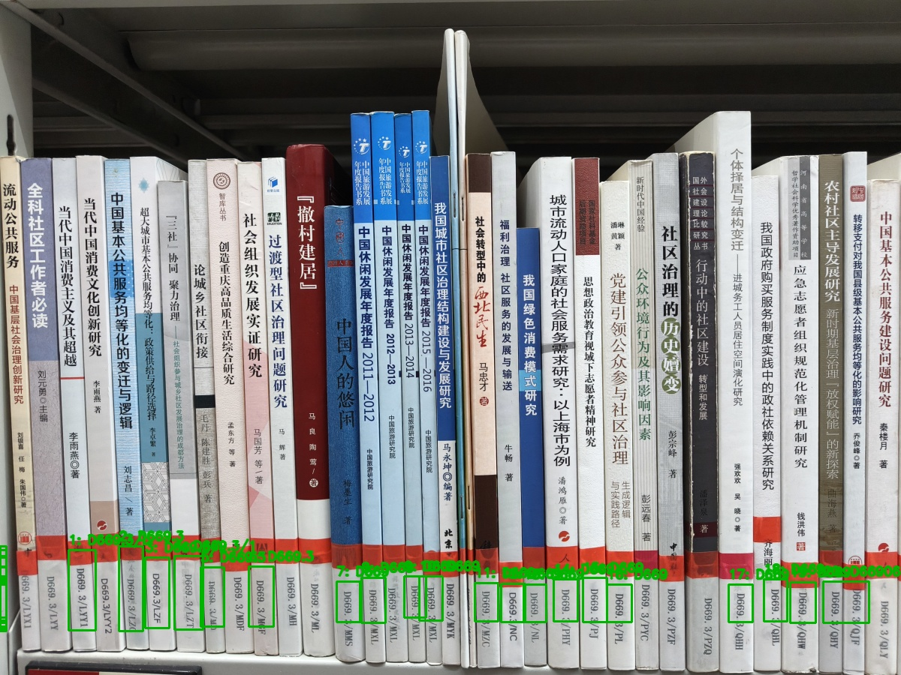

- 自动选择方向：none
- 图像质量：good，评分：98.4
- 检测书本数：20
- 本图耗时：45.9s
- 错序/可疑位置：无
- 系统提示：图像质量较好。
- 当前顺序：D669.3/L -> D669.3 -> D669.3/L -> D669.3/1 -> D669.3 -> D669.3 -> D669 -> D669 -> D669 -> D669 -> D669 -> D669 -> D669 -> D669 -> D669 -> D669 -> D669 -> D669 -> D669 -> D6690669
- 推荐顺序：D669.3/L -> D669.3 -> D669.3/L -> D669.3/1 -> D669.3 -> D669.3 -> D669 -> D669 -> D669 -> D669 -> D669 -> D669 -> D669 -> D669 -> D669 -> D669 -> D669 -> D669 -> D669 -> D6690669

### IMG20260517094708.jpg

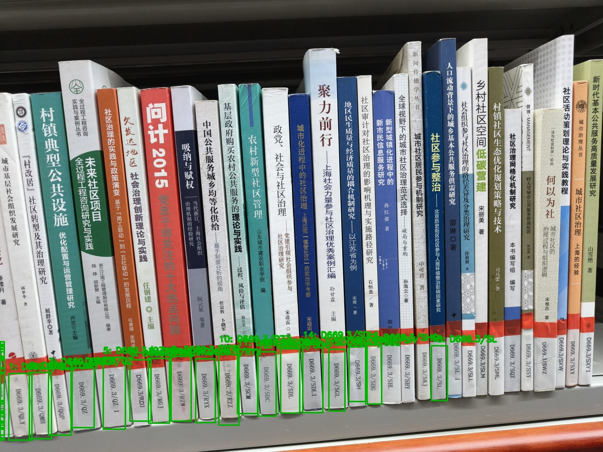

- 自动选择方向：none
- 图像质量：good，评分：99.4
- 检测书本数：18
- 本图耗时：28.2s
- 错序/可疑位置：无
- 系统提示：图像质量较好。
- 当前顺序：D669.3/QLY -> D669.3/QMH -> D669.3/QQP -> D669.3/QZ -> D669.3/QZ1 -> D669.3/RDJ -> D669.3/RGJ -> D669.3/RZW -> D669.3/RYX -> D669.3/RZZ -> D669.3/SCM -> D669.3/SDC -> D669.3/SDL -> D669.3/SDL1 -> D669.3/SGL -> D669.3/SH -> D669.3/SHG -> D669.3/SL
- 推荐顺序：D669.3/QLY -> D669.3/QMH -> D669.3/QQP -> D669.3/QZ -> D669.3/QZ1 -> D669.3/RDJ -> D669.3/RGJ -> D669.3/RZW -> D669.3/RYX -> D669.3/RZZ -> D669.3/SCM -> D669.3/SDC -> D669.3/SDL -> D669.3/SDL1 -> D669.3/SGL -> D669.3/SH -> D669.3/SHG -> D669.3/SL
